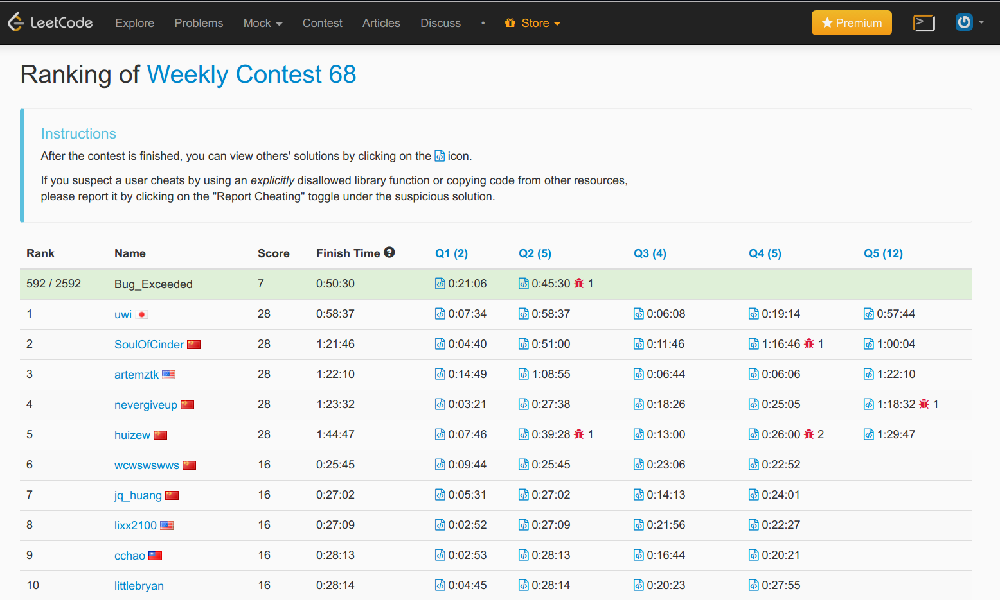

# LeetCode_OJWeekly_Contest_68 on 2017/5/28
Contest URL: https://leetcode.com/contest/weekly-contest-68/
AC'd problem: A B (C D after competition, reference to discussion and E not solved )

Briefly introduction to problems
A.水題(easy problem)
B.Greedy algorithm which I have done in geeksforgeeks before.
C.Logic and inspection + observation the rule in it
D.Hard logic, kind of two pointer and partition
